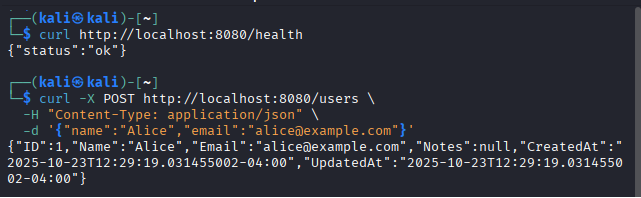
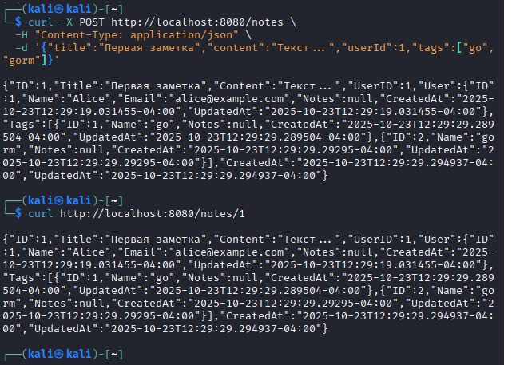

## практическа работа 6

### ЭФМО-02-25 Фомичев Александр Сергеевич

#### Структура проекта
```
pz6-gorm/
  cmd/server/main.go
  internal/db/postgres.go
  internal/models/models.go
  internal/http/router.go
  internal/http/handlers.go
  go.mod
         
```
### Цели:
1.	Понять, что такое ORM и чем удобен GORM.
2.	Научиться описывать модели Go-структурами и автоматически создавать таблицы (миграции через AutoMigrate).
3.	Освоить базовые связи: 1:N и M:N + выборки с Preload.
4.	Написать короткий REST (2–3 ручки) для проверки результата.
 

## запуск и проверка

**проверка**



.png)


